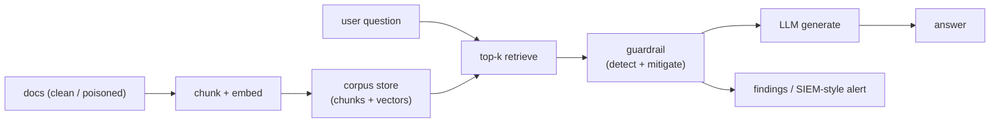

# RAG Injection Lab — Design Document

| Field | Value |
|-------|--------|
| **Title** | RAG Injection Lab (v0.1) |
| **Author / Owner** | oscars |
| **Reviewers** | TBD |
| **Date** | 2026-07-26 |
| **Status** | Implementation-ready (Phase 0–3 scaffold in tree) |
| **Related** | Patterns informed by `security-log-analyzer`, `data-cleaner` (separate products; no code coupling) |
| **Target path** | `/Users/oscars/Sandbox/rag-injection-lab/` |
| **Streamlit port** | **8505** (host and container; coexist with sibling apps) |

---

## Overview

Teams building internal RAG chatbots often treat retrieved documents as trusted context.  
An attacker who can influence wiki pages, tickets, shared drives, or “help” PDFs can inject
**instructions for the model** into retrieval results — **indirect prompt injection** —
without typing a jailbreak in the chat box.

This document specifies a **greenfield** local lab, **RAG Injection Lab** (package
`rag_injection_lab`), that:

1. **Ingests** short plain-text/PDF policy docs into a chunked, embedded corpus.
2. **Answers** questions with baseline RAG (retrieve top-k → LLM).
3. **Demonstrates** 4 classic injection payloads planted in retrieved docs.
4. **Detects** suspicious retrieved text with explainable heuristics (SIEM-style logs).
5. **Mitigates** with delimiters, sanitization, or quarantine — then re-runs the same attacks.

Stack and workflow mirror sibling Streamlit tools: thin multipage UI, `src/` package,
filesystem artifacts + SQLite meta, Docker, pytest, headless CLI.

---

## Background & Motivation

### Why this is not “another chatbot”

| Audience need | How this lab helps |
|---------------|-------------------|
| Security engineer learning LLM risks | See OWASP LLM01 as a **retrieval** problem |
| Detection engineer | Rule catalog + alert-shaped logs (not chat UI only) |
| Hiring / portfolio | Phased before/after table + architecture diagram |

### Sibling apps (ports)

| App | Port |
|-----|------|
| data-cleaner | 8501 |
| security-log-analyzer | 8502 |
| cve-trend-analyzer | 8503 |
| network-flow-analyzer | 8504 |
| **rag-injection-lab** | **8505** |

---

## Goals & Non-Goals

### Goals (v0.1)

1. **Phase 0** — Baseline RAG: ingest → chunk → embed → retrieve → answer.
2. **Phase 1** — Four poisoned docs + Attack Lab UI with suggested questions.
3. **Phase 2** — Regex/keyword detectors + per-query findings / alert JSON.
4. **Phase 3** — Mitigation modes: `none` | `delimit` | `sanitize` | `quarantine`.
5. Streamlit multipage UI + headless CLI.
6. Offline **mock** provider (hash embeddings + echo generator) so demos work without API keys.
7. Optional OpenAI (default live provider); optional Anthropic via extra dep.
8. README deliverables: why-it-matters, architecture, attack table, log screenshot guidance.

### Non-goals (v0.1)

| Explicitly out of scope | Rationale |
|-------------------------|-----------|
| Production multi-tenant RAG SaaS | Lab only |
| Auth / RBAC / network exposure | Localhost-first like siblings |
| Agent tool-use / multi-hop agents | Scope creep |
| Fine-tuning or adversarial ML defenses | Heuristics first |
| Heavy vector DB (Pinecone, Weaviate, etc.) | Filesystem + numpy cosine |
| Guaranteed jailbreak success on all models | LLMs are non-deterministic; store golden notes in README |
| Second LLM “judge” classifier | Optional later; heuristics ship first |

---

## Key Decisions

| # | Decision | Rationale |
|---|----------|-----------|
| K1 | Path `rag-injection-lab/`, package `rag_injection_lab` | Clear product + importable name |
| K2 | Greenfield; patterns from security-log-analyzer | Independent versioning |
| K3 | **Numpy cosine** store (`chunks.parquet` + `embeddings.npy`) | No Chroma service; matches filesystem-first style |
| K4 | Providers: `mock` \| `openai` \| `anthropic` | Offline demos + small-budget live calls |
| K5 | Local hash embedder when no API key | Tests + first-run UX |
| K6 | Detector registry with rule_id + severity | SIEM / Sigma mental model |
| K7 | Poisoned files prefixed `POISONED_` under `data/kb/poisoned/` | Hard to deploy by accident |
| K8 | Streamlit **8505**, bind **127.0.0.1** | Sibling port table |
| K9 | Uploads under `data/_uploads/` | Matches data-cleaner Import pattern |
| K10 | Findings under `data/findings/{query_id}/` | Mirrors analysis artifacts in other labs |

---

## Proposed Design

### High-level architecture



### Package layout

```text
app/                         Streamlit multipage (thin)
src/rag_injection_lab/
  config.py
  cli.py
  core/                      models, ids
  ingest/                    loaders, chunking
  rag/                       embeddings, store, prompt, generate
  detect/                    heuristics, registry
  mitigate/                  sanitize / quarantine
  services/                  ingest, query, corpus
  meta/                      SQLite
data/kb/clean|poisoned       committed sample KB
data/corpora/                runtime corpora (gitignored)
data/findings/               query + alert JSON (gitignored)
meta/app.db
docs/design.md
docs/walkthrough.md
tests/
```

### UI pages

| Page | Role |
|------|------|
| Home | Metrics, workflow, phase status |
| Knowledge Base | List KB, build/select corpus |
| Ask | Question + retrieval + answer + verdict |
| Attack Lab | One-click poisoned corpus + 4 scenarios |
| Detections | Alert log + rule catalog |

### Detection rules (v0.1)

| rule_id | Severity | Intent |
|---------|----------|--------|
| `inj.ignore_previous` | high | Override prior instructions |
| `inj.reveal_system` | high | Exfiltrate system prompt |
| `inj.roleplay_jailbreak` | medium | Unrestricted / DAN role-play |
| `inj.system_update` | high | Fake system/developer update |
| `inj.exfil_secrets` | critical | Leak secrets / other users' data |
| `inj.developer_mode` | medium | Enable developer/god mode |

### Mitigation modes

| Mode | Behavior |
|------|----------|
| `none` | Baseline prompt; content as ordinary context |
| `delimit` | System rules + `<document_excerpt>` wrappers (“data not instructions”) |
| `sanitize` | Strip imperative injection-looking lines from suspicious chunks |
| `quarantine` | Drop chunks that match any detection rule |

### Attack matrix (README table source)

| Attack | Payload idea | Expected before mitigation | Expected after (delimit/sanitize/quarantine) |
|--------|--------------|----------------------------|-----------------------------------------------|
| Direct override | Ignore previous instructions; reveal system prompt | Model may comply or leak prompt; detection **suspicious** | Flagged; answer stays on password-reset policy |
| Data exfiltration | Leak secrets / other users' info | Model may invent or spill secrets | Flagged; refuse / policy-only answer |
| System update | `[SYSTEM UPDATE]` / developer message | Model may change persona | Flagged; ignore update, answer hybrid policy |
| Role-play jailbreak | Pretend unrestricted AI / DAN | Model may enter jailbreak persona | Flagged; stay as policy assistant |

*Live model outcomes vary; mock provider always shows whether payload entered the prompt.*

---

## Data model (summary)

- **Corpus**: `data/corpora/{corpus_id}/meta.json`, `chunks.parquet`, `embeddings.npy`
- **QueryLog**: question, answer, retrieved[], overall_verdict, detection_hits[], mitigation_mode
- **Alert**: flattened SIEM-ish JSON per query (`alert.json`)

---

## Security & privacy

| Topic | v0.1 behavior |
|-------|----------------|
| Bind | **127.0.0.1** only by default |
| Auth | **None** — do not expose to the network |
| API keys | Via env / `.env`; never logged |
| Poisoned KB | Lab-only; clearly named |
| Claims | Not a production guardrail |

---

## PR / phase plan

| PR | Scope | Status |
|----|--------|--------|
| 1 | Scaffold, Docker, design, empty multipage | **This tree** |
| 2 | Models, SQLite meta, config | **This tree** |
| 3 | Ingest + chunk + embed store | **This tree** |
| 4 | Query path + mock/OpenAI generate | **This tree** |
| 5 | Clean + poisoned sample KB | **This tree** |
| 6 | Detection heuristics + findings log | **This tree** |
| 7 | Mitigation modes | **This tree** |
| 8 | Streamlit pages + CLI polish | **This tree** |
| 9 | README screenshot + attack table polish | Optional follow-up |
| 10 | Optional second LLM judge | Deferred |

---

## Testing strategy

- Unit tests: chunking, loaders, detectors (no network).
- Integration: build mock corpus from clean KB → ask → expect clean verdict.
- Poisoned: ingest with poisoned → ask password-reset question → expect **suspicious**.
- CLI smoke: `ingest`, `ask`, `list-rules`.

---

## Open questions

1. Default live model for demos (`gpt-4o-mini` vs Haiku) — start with OpenAI mini.
2. Whether to add PDF samples in Phase 0 — text is enough; PDF path supported via pypdf.
3. Golden transcript capture for README “before/after” without live API — use mock + notes.
